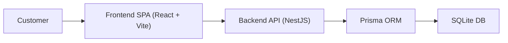
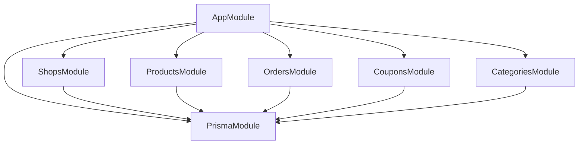
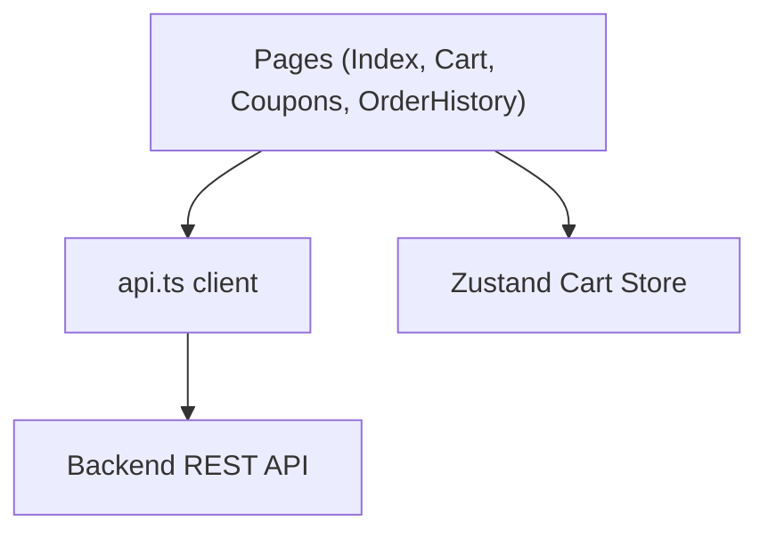

# C4 Model - Meal Magic Delivery

Last updated: 2026-03-29

## Level 1 - System Context
- Primary actor: Customer (web user)
- Main system: Meal Magic Delivery Web App
- External dependency: Hosting platform (Vercel or Docker host)
- Data persistence: SQLite database (via backend service)

## Level 2 - Container Diagram

Containers:
- `frontend` - user interface, product browsing, cart, order history, coupons.
- `backend` - REST API, validation, business rules, Swagger docs.
- `database` - SQLite file used by Prisma datasource.

## Level 3 - Component Diagram (Backend)

Key responsibilities:
- `ShopsModule`: rating-based shop filtering.
- `ProductsModule`: pagination, sorting, category filtering.
- `OrdersModule`: create order, validate payload, history search with pagination.
- `CouponsModule`: coupon list, validation, pagination.
- `CategoriesModule`: lookup list for filters.

## Level 3 - Component Diagram (Frontend)

Key responsibilities:
- UI pages render product/cart/order/coupon flows.
- `api.ts` maps backend DTOs to frontend view models.
- Store keeps cart state and supports reorder flow.

## Level 4 - Code Mapping
- Backend source: `backend/src/**`
- Prisma schema and seed: `backend/prisma/schema.prisma`, `backend/prisma/seed.ts`
- Frontend source: `frontend/src/**`
- Frontend API client: `frontend/src/lib/api.ts`
- Deployment configs: `docker-compose.yml`, `docker-compose.hosting.yml`, `vercel.json`
